# Snowflake Data Clean Room (DCR) v5.5 - Execution & Cost Analysis

## 📊 Executive Summary

In a Snowflake Data Clean Room, **the Consumer pays for most of the compute costs** because the queries actually execute in the Consumer's account. The Provider primarily pays for setup/maintenance tasks and request validation.

---

## 🏗️ Architecture Overview

```mermaid
flowchart TB
    subgraph PROVIDER["🏢 PROVIDER ACCOUNT"]
        direction TB
        PD[("📊 Provider Data<br/>customers, exposures")]
        PT["📝 Templates<br/>(allowed queries)"]
        RS["🔄 Request Stream<br/>& Validation Tasks"]
        RL["📋 Request Log<br/>(approval status)"]
        RAP["🛡️ Row Access Policy<br/>(Data Firewall)"]
        
        PD --> RAP
        RS --> RL
    end
    
    subgraph CONSUMER["🏪 CONSUMER ACCOUNT"]
        direction TB
        CD[("📊 Consumer Data<br/>customers, conversions")]
        MS["📦 Mounted Share<br/>(dcr_samp_app)"]
        RP["⚙️ Request Procedure<br/>(builds & submits)"]
        QE["🚀 Query Execution<br/>💰💰💰 MAIN COST"]
        
        RP --> QE
        CD --> QE
    end
    
    PROVIDER -->|"Secure Share<br/>(templates, protected views)"| MS
    RP -->|"Request Share<br/>(requests table)"| RS
    RL -->|"Shared back via<br/>provider_log view"| CONSUMER
    MS --> QE
    
    style QE fill:#ff6b6b,stroke:#c92a2a,color:#fff
    style RAP fill:#4dabf7,stroke:#1971c2,color:#fff
    style PROVIDER fill:#e7f5ff,stroke:#1971c2
    style CONSUMER fill:#fff3bf,stroke:#f59f00
```



---

## 🔄 Query Request Flow (Sequence Diagram)

```mermaid
sequenceDiagram
    autonumber
    participant C as 🏪 Consumer Account
    participant CW as 💰 Consumer Warehouse
    participant PS as 📦 Provider Share
    participant P as 🏢 Provider Account
    participant PW as 💰 Provider Warehouse

    Note over C,P: Phase 1: Request Submission
    C->>CW: Call request() procedure
    CW->>PS: Fetch template
    PS-->>CW: Return template
    CW->>CW: Substitute parameters<br/>Compute SHA2 hash
    CW->>C: Insert into requests table
    C->>P: Request flows via share

    Note over C,P: Phase 2: Validation (Provider pays ~10%)
    P->>PW: Stream triggers task
    PW->>PW: Validate timestamp<br/>Check dimensions<br/>Recompute hash
    PW->>P: Log approval/rejection
    P-->>C: Approval visible via provider_log

    Note over C,P: Phase 3: Query Execution (Consumer pays ~90%)
    C->>CW: Execute approved query
    CW->>PS: Access provider views
    Note right of CW: Row Access Policy<br/>validates query hash
    PS-->>CW: Return matching rows
    CW->>CW: Join with consumer data<br/>Aggregate results
    CW-->>C: Return results<br/>(aggregated only)
```



---

## 💰 Cost Breakdown by Party

### **PROVIDER Costs** (Lower - ~10-20% of total)

| Activity | When | Warehouse Used | Cost Level |
|----------|------|----------------|------------|
| **Initial Setup** | One-time | `app_wh` | 💰 Low |
| Create databases, schemas, tables | | | |
| Create Python UDF (`get_sql_jinja`) | | | |
| Create shares, templates | | | |
| **Request Validation Tasks** | Ongoing (every 1 min) | `app_wh` | 💰💰 Low-Medium |
| 6 tasks check stream for new requests | | | |
| Validate timestamp, dimensions, query hash | | | |
| Log approval/rejection | | | |
| **Data Storage** | Ongoing | N/A (storage) | 💰 Low |
| Provider's own data tables | | | |

**Key Provider Scripts:**
- `provider_init.sql` - Initial setup
- `provider_enable_consumer.sql` - Enable consumer & start validation tasks
- `provider_templates.sql` - Define allowed query templates

---

### **CONSUMER Costs** (Higher - ~80-90% of total)

| Activity | When | Warehouse Used | Cost Level |
|----------|------|----------------|------------|
| **Initial Setup** | One-time | `app_wh` | 💰 Low |
| Create databases, schemas | | | |
| Mount provider's share | | | |
| Create request procedure | | | |
| **Request Submission** | Per request | `app_wh` | 💰 Low |
| Build query from template | | | |
| Compute query hash | | | |
| Insert into requests table | | | |
| **Query Execution** | Per request | `app_wh` | 💰💰💰 **HIGH** |
| Actually run the approved query | | | |
| Join provider + consumer data | | | |
| Scan potentially millions of rows | | | |
| **Data Storage** | Ongoing | N/A (storage) | 💰 Low |
| Consumer's own data tables | | | |

**Key Consumer Scripts:**
- `consumer_init.sql` - Initial setup
- `consumer_data.sql` - Load consumer data
- `consumer_request.sql` - Submit queries

---

## 🔐 The "Data Firewall" - How Security Works

```mermaid
flowchart LR
    subgraph Consumer["Consumer Runs Query"]
        Q["SELECT ... FROM provider_view"]
    end
    
    subgraph RAP["Row Access Policy Check"]
        C1{"Is this the<br/>approved account?"}
        C2{"Is request<br/>approved?"}
        C3{"Does query hash<br/>match exactly?"}
    end
    
    subgraph Result["Query Result"]
        R1["✅ Data Returned"]
        R2["❌ Zero Rows<br/>(silently blocked)"]
    end
    
    Q --> C1
    C1 -->|Yes| C2
    C1 -->|No| R2
    C2 -->|Yes| C3
    C2 -->|No| R2
    C3 -->|Yes| R1
    C3 -->|No| R2
    
    style R1 fill:#51cf66,stroke:#2f9e44,color:#fff
    style R2 fill:#ff6b6b,stroke:#c92a2a,color:#fff
```



The magic happens through a **Row Access Policy** on the provider's views:

```sql
-- From provider_init.sql
CREATE OR REPLACE ROW ACCESS POLICY data_firewall AS (foo VARCHAR) 
RETURNS BOOLEAN ->
    EXISTS (
        SELECT request_id 
        FROM dcr_samp_provider_db.admin.request_log w
        WHERE party_account = current_account()
          AND approved = true
          AND query_hash = sha2(current_statement())
    );
```

**How it works:**
1. Provider's data views have this policy attached
2. When Consumer runs a query, the policy checks:
   - Is this the approved consumer account?
   - Is there an approved request?
   - Does the **exact query text hash** match what was approved?
3. If all checks pass → data is returned
4. If any check fails → **zero rows returned** (not an error, just empty)

**This means:**
- ✅ Consumer can only run **pre-approved query templates**
- ✅ Consumer cannot modify the query after approval
- ✅ Provider never sees Consumer's raw data
- ✅ Consumer only sees aggregated results (with `HAVING count > 25` privacy threshold)

---

## 📋 What Each Party Can See

```mermaid
flowchart TB
    subgraph Provider["🏢 Provider"]
        P1["✅ Own raw data"]
        P2["✅ Query templates"]
        P3["✅ Request parameters"]
        P4["✅ Approval status"]
        P5["❌ Consumer's raw data"]
        P6["❌ Query results"]
    end
    
    subgraph Consumer["🏪 Consumer"]
        C1["✅ Own raw data"]
        C2["✅ Query templates"]
        C3["✅ Request parameters"]
        C4["✅ Approval status"]
        C5["✅ Query results (aggregated)"]
        C6["❌ Provider's raw data"]
    end
    
    style P1 fill:#51cf66,stroke:#2f9e44
    style P2 fill:#51cf66,stroke:#2f9e44
    style P3 fill:#51cf66,stroke:#2f9e44
    style P4 fill:#51cf66,stroke:#2f9e44
    style P5 fill:#ff6b6b,stroke:#c92a2a
    style P6 fill:#ff6b6b,stroke:#c92a2a
    
    style C1 fill:#51cf66,stroke:#2f9e44
    style C2 fill:#51cf66,stroke:#2f9e44
    style C3 fill:#51cf66,stroke:#2f9e44
    style C4 fill:#51cf66,stroke:#2f9e44
    style C5 fill:#51cf66,stroke:#2f9e44
    style C6 fill:#ff6b6b,stroke:#c92a2a
```



| Data | Provider Can See | Consumer Can See |
|------|------------------|------------------|
| Provider's raw data | ✅ Yes | ❌ No (protected by Row Access Policy) |
| Consumer's raw data | ❌ No | ✅ Yes |
| Approved query templates | ✅ Yes (defines them) | ✅ Yes (via share) |
| Request parameters | ✅ Yes (in request_log) | ✅ Yes (submits them) |
| Query results | ❌ No | ✅ Yes (aggregated only) |
| Request approval status | ✅ Yes | ✅ Yes (via provider_log view) |

---

## 💵 Relative Cost Estimates


Assuming a typical use case with:
- 1M provider records
- 1M consumer records
- 10 queries per day

| Party | Activity | Estimated % of Total Cost |
|-------|----------|---------------------------|
| **Provider** | Setup (one-time) | 1% |
| **Provider** | Validation tasks (6 tasks × 24/7) | 5-10% |
| **Provider** | Storage | 2-5% |
| **Consumer** | Setup (one-time) | 1% |
| **Consumer** | Request submission | 2-5% |
| **Consumer** | **Query execution** | **70-85%** |
| **Consumer** | Storage | 2-5% |

### Why Consumer Pays More

1. **Query Execution Location**: The final query runs in the Consumer's account
2. **Data Scanning**: Consumer's warehouse scans both:
   - Provider's shared views (via Secure Data Sharing)
   - Consumer's own tables
3. **Join Operations**: Complex joins between datasets happen in Consumer's compute
4. **Aggregations**: COUNT, GROUP BY operations use Consumer's compute

---

## 🔄 Step-by-Step Execution Flow

### Phase 1: Setup (One-Time)


### Phase 2: Enable Consumer (One-Time per Consumer)


### Phase 3: Query Request Flow (Per Query)

```mermaid
flowchart TB
    subgraph Consumer["🏪 Consumer Account"]
        C1["1. Call request() procedure"]
        C2["2. Fetch template from share"]
        C3["3. Substitute parameters"]
        C4["4. Compute SHA2 hash"]
        C5["5. Insert into requests table"]
        C9["6. Poll provider_log view"]
        C10["7. See APPROVED = TRUE"]
        C11["8. Copy approved query"]
        C12["9. 🚀 EXECUTE QUERY<br/>💰💰💰 MAIN COST"]
        C13["10. Get results"]
        
        C1 --> C2 --> C3 --> C4 --> C5
        C9 --> C10 --> C11 --> C12 --> C13
    end
    
    subgraph Provider["🏢 Provider Account"]
        P1["Stream detects request"]
        P2["Task wakes up (~10 sec)"]
        P3["Validate timestamp"]
        P4["Check dimensions"]
        P5["Recompute query hash"]
        P6["Compare hashes"]
        P7["Log approval/rejection"]
        
        P1 --> P2 --> P3 --> P4 --> P5 --> P6 --> P7
    end
    
    C5 -->|"Request flows"| P1
    P7 -->|"Approval visible"| C9
    
    style C12 fill:#ff6b6b,stroke:#c92a2a,color:#fff
```



---

## 📝 Example Query Flow

When Consumer runs:

```sql
CALL dcr_samp_consumer.PROVIDER_ACCT_schema.request(
    'customer_overlap',
    object_construct('dimensions', array_construct('c.zip', 'c.pets', 'p.age_band'))::varchar, 
    NULL, 
    NULL
);
```

This generates a query like:

```sql
SELECT c.zip, c.pets, p.age_band, COUNT(DISTINCT p.email) AS overlap
FROM dcr_samp_app.cleanroom.provider_customers_vw p,
     dcr_samp_consumer.mydata.customers c
WHERE c.email = p.email
  AND EXISTS (...)  -- table validation
GROUP BY c.zip, c.pets, p.age_band
HAVING COUNT(DISTINCT p.email) > 25  -- privacy threshold
ORDER BY COUNT(DISTINCT p.email) DESC;
```

**Cost incurred by:**
- Provider: ~0.1 credits (validation task)
- Consumer: ~1-10 credits (depending on data size and warehouse)

---

## 🎯 Simple Explanation for Customers

### For the Provider (Data Owner):

> "You share your data securely through Snowflake's sharing. You define what queries are allowed (templates) and automatically approve requests that match. Your data never leaves your account - consumers can only see aggregated results. Your main costs are the background tasks that validate requests (runs every minute, very lightweight)."

### For the Consumer (Data Buyer/Analyst):

> "You bring your own data and run approved queries that match your data with the provider's data. The queries run in YOUR account using YOUR warehouse, so you pay for the compute. You only see aggregated results (e.g., 'X customers overlap') - never raw individual records. This gives you insights while protecting both parties' data."

### Cost Summary:

> "**Consumer pays ~80-90% of compute costs** because queries run in their account. Provider pays ~10-20% for validation tasks that run in the background. Both parties pay for their own data storage."

---

## 🚀 Optimization Tips

### For Providers:
1. Use smaller warehouses for validation tasks (XS is usually sufficient)
2. Consider reducing task frequency if latency isn't critical
3. Cluster data on join columns for faster query performance

### For Consumers:
1. Use appropriately-sized warehouses for query complexity
2. Add time-travel timestamps to queries for point-in-time consistency
3. Pre-filter your data before joining to reduce scan costs

---

## 📚 Key Files Reference

| File | Purpose | Executed By |
|------|---------|-------------|
| `provider_init.sql` | Initial provider setup, create share | Provider |
| `provider_data.sql` | Load provider sample data | Provider |
| `provider_templates.sql` | Define allowed query templates | Provider |
| `provider_enable_consumer.sql` | Enable consumer, start validation tasks | Provider |
| `consumer_init.sql` | Initial consumer setup, mount share | Consumer |
| `consumer_data.sql` | Load consumer sample data, configure settings | Consumer |
| `consumer_request.sql` | Submit and execute queries | Consumer |

