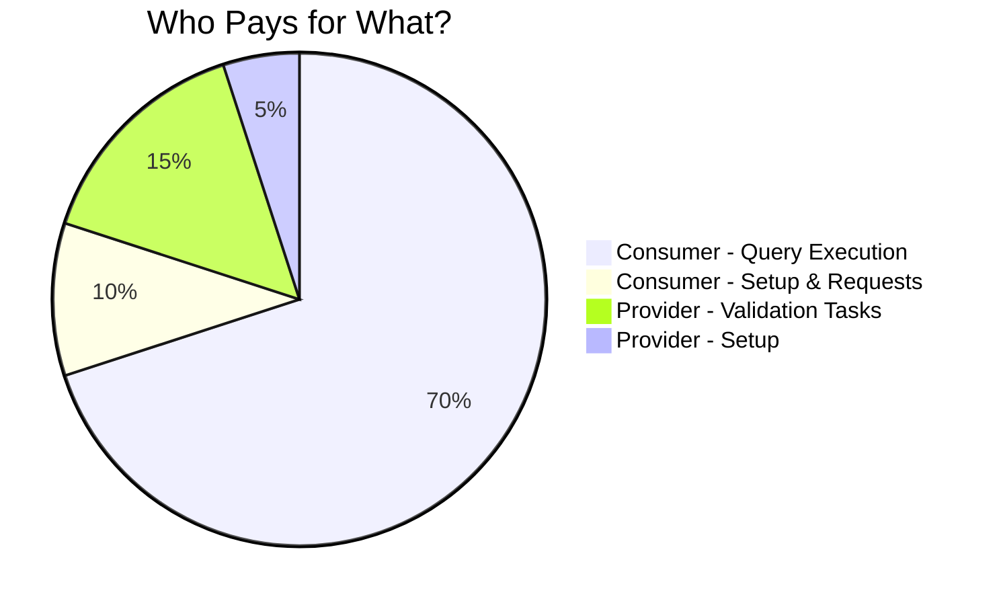

# Snowflake Data Clean Room: Execution Flow & Cost Guide

A concise guide explaining where queries run and who pays in a Snowflake Data Clean Room.

---

## Quick Summary

| Party | What They Do | Pays For |
|-------|-------------|----------|
| **Provider** | Hosts data, validates requests, approves queries | Tasks, request processing, template validation |
| **Consumer** | Submits requests, executes approved queries | Query execution, data scanning, result generation |

> **Key Insight**: The Consumer pays for the heavy lifting (query execution), while the Provider pays for lightweight validation tasks.

---

## Architecture Overview

```mermaid
flowchart TB
    subgraph Provider["🏢 PROVIDER ACCOUNT"]
        PD[(Provider Data<br/>customers, exposures)]
        PT[Templates]
        RL[Request Log]
        DF[Data Firewall<br/>Row Access Policy]
        TASK[Validation Tasks]
    end
    
    subgraph Share["📤 SECURE SHARE"]
        SV[Protected Views]
        TMP[Templates View]
        LOG[Provider Log View]
    end
    
    subgraph Consumer["🏪 CONSUMER ACCOUNT"]
        CD[(Consumer Data<br/>customers, conversions)]
        REQ[Request Table]
        APP[Mounted Clean Room App]
        PROC[Request Procedure]
    end
    
    PD --> DF --> SV
    PT --> TMP
    RL --> LOG
    
    SV --> APP
    TMP --> APP
    LOG --> APP
    
    REQ -.->|Shared Back| Provider
    
    style Provider fill:#e3f2fd
    style Consumer fill:#fff3e0
    style Share fill:#f3e5f5
```

---

## Request Lifecycle

---

## Cost Breakdown by Phase

### Phase 1: Setup (One-time)

| Action | Who Runs | Who Pays | Cost Level |
|--------|----------|----------|------------|
| Create provider database, schemas, templates | Provider | Provider | 💰 Low |
| Create secure views with data firewall | Provider | Provider | 💰 Low |
| Create share and listing | Provider | Provider | 💰 Low |
| Mount shared database | Consumer | Consumer | 💰 Low |
| Create request tables and procedures | Consumer | Consumer | 💰 Low |

### Phase 2: Request Submission

| Action | Who Runs | Who Pays | Cost Level |
|--------|----------|----------|------------|
| Call `request()` stored procedure | Consumer | Consumer | 💰 Low |
| Build SQL from Jinja template | Consumer | Consumer | 💰 Low |
| Insert request into shared table | Consumer | Consumer | 💰 Low |

### Phase 3: Validation (Provider Tasks)

| Action | Who Runs | Who Pays | Cost Level |
|--------|----------|----------|------------|
| Stream monitors for new requests | Provider | Provider | 💰 Low |
| Task runs `process_requests()` | Provider | Provider | 💰💰 Medium |
| Validate timestamp, dimensions | Provider | Provider | 💰 Low |
| Regenerate query hash | Provider | Provider | 💰 Low |
| Write to request_log | Provider | Provider | 💰 Low |

> ⚠️ Provider runs **6 parallel tasks** every minute per consumer - this is a recurring cost.

### Phase 4: Query Execution (The Heavy Lifting)

| Action | Who Runs | Who Pays | Cost Level |
|--------|----------|----------|------------|
| Execute approved query | Consumer | Consumer | 💰💰💰 **HIGH** |
| Scan provider data (via secure views) | Consumer | Consumer | 💰💰💰 **HIGH** |
| Scan consumer data | Consumer | Consumer | 💰💰💰 **HIGH** |
| Join and aggregate results | Consumer | Consumer | 💰💰💰 **HIGH** |

---

## Visual Cost Distribution

---

## The Data Firewall: How It Works

The Provider's data is protected by a **Row Access Policy** that only allows access when:

1. The query hash matches an approved request
2. The request was made by the current account
3. The request has been approved

```mermaid
flowchart LR
    Q[Consumer Query] --> DF{Data Firewall}
    DF -->|Hash matches approved request| D[(Provider Data)]
    DF -->|Hash doesn't match| X[❌ No rows returned]
    
    style DF fill:#ffcdd2
    style D fill:#c8e6c9
    style X fill:#ffcdd2
```

---

## Key Takeaways for Customers

1. **Consumer pays most costs** - They execute the actual queries that scan data
2. **Provider pays validation costs** - Lightweight but recurring (tasks run every minute)
3. **Data never moves** - Only queries and results cross account boundaries
4. **Templates control access** - Provider defines exactly what queries are allowed
5. **Aggregation enforced** - `HAVING count(*) > 25` prevents individual record exposure

---

## Warehouse Sizing Recommendations

| Party | Workload | Recommended Size |
|-------|----------|------------------|
| Provider | Validation tasks | X-Small or Small |
| Consumer | Query execution | Small to Medium (depends on data volume) |

---

## Cross-Cloud Considerations

When Provider and Consumer are in different clouds/regions (e.g., GCP to AWS):

- **Auto-fulfillment** replicates shared data
- **Additional replication costs** apply to the Provider
- **Refresh schedule** (2 minutes in this setup) affects data freshness

```mermaid
flowchart LR
    subgraph GCP["☁️ GCP (Provider)"]
        PD[(Provider Data)]
    end
    
    subgraph AWS["☁️ AWS (Consumer)"]
        RD[(Replicated Data)]
        CD[(Consumer Data)]
    end
    
    PD -->|Auto-fulfillment<br/>Every 2 min| RD
    RD --> JOIN{Join}
    CD --> JOIN
    JOIN --> R[Results]
    
    style GCP fill:#e8f5e9
    style AWS fill:#fff3e0
```

---

*Document generated from DCR v5.5 scripts*

