# Walmart Data Clean Room: Execution Flow & Cost Guide

A concise guide explaining where queries run and who pays in a Snowflake Data Clean Room between **Walmart** and **Advertisers**.

---

## Quick Summary

| Party | What They Do | Pays For |
|-------|-------------|----------|
| **Advertiser** (Provider) | Hosts ad exposure data, validates requests, approves queries | Tasks, request processing, template validation |
| **Walmart** (Consumer) | Submits requests, executes approved queries | Query execution, data scanning, result generation |

> **Key Insight**: Walmart pays for the heavy lifting (query execution), while the Advertiser pays for lightweight validation tasks.

---

## Architecture Overview

```mermaid
%%{init: {'theme': 'base', 'themeVariables': {'lineColor': '#333333', 'fontSize': '26px'}}}%%
flowchart LR
    subgraph ADVERTISER["📺 ADVERTISER (Provider)"]
        AD[("Data:<br/>customers,<br/>exposures")]
        ADF["🛡️ data_firewall"]
        AT["templates"]
        ARL["request_log"]
        ARS["request_stream"]
        APR["⚙️ process_requests"]
        
        AD --- ADF
        ARS --> APR --> ARL
    end
    
    subgraph WALMART["🛒 WALMART (Consumer)"]
        WD[("Data:<br/>customers,<br/>conversions")]
        WT["templates<br/>(mounted)"]
        WPL["provider_log<br/>(mounted)"]
        WRQ["requests"]
        WRP["⚙️ request()"]
        WQE["🚀 QUERY<br/>EXECUTION<br/>💰💰💰"]
        
        WT --> WRP --> WRQ
        WPL --> WQE
        WD --> WQE
    end
    
    AT -.->|"share"| WT
    ARL -.->|"share"| WPL
    WRQ -.->|"share"| ARS
    ADF -.->|"if approved"| WQE
    
    style ADVERTISER fill:#e6f7ff,stroke:#00A1D9,stroke-width:3px
    style WALMART fill:#cce5ff,stroke:#0071ce,stroke-width:3px
    style WQE fill:#ffc220,stroke:#333,stroke-width:3px,color:#000
    style ADF fill:#00A1D9,stroke:#333,stroke-width:3px,color:#fff
    
    linkStyle default stroke:#333,stroke-width:2px
    linkStyle 5,6,7,8 stroke:#0071ce,stroke-width:3px
```

---

## Request Lifecycle

---

## Cost Breakdown by Phase

### Phase 1: Setup (One-time)

| Action | Who Runs | Who Pays | Cost Level |
|--------|----------|----------|------------|
| Create advertiser database, schemas, templates | Advertiser | Advertiser | 💰 Low |
| Create secure views with data firewall | Advertiser | Advertiser | 💰 Low |
| Create share and listing | Advertiser | Advertiser | 💰 Low |
| Mount shared database | Walmart | Walmart | 💰 Low |
| Create request tables and procedures | Walmart | Walmart | 💰 Low |

### Phase 2: Request Submission

| Action | Who Runs | Who Pays | Cost Level |
|--------|----------|----------|------------|
| Call `request()` stored procedure | Walmart | Walmart | 💰 Low |
| Build SQL from Jinja template | Walmart | Walmart | 💰 Low |
| Insert request into shared table | Walmart | Walmart | 💰 Low |

### Phase 3: Validation (Advertiser Tasks)

| Action | Who Runs | Who Pays | Cost Level |
|--------|----------|----------|------------|
| Stream monitors for new requests | Advertiser | Advertiser | 💰 Low |
| Task runs `process_requests()` | Advertiser | Advertiser | 💰💰 Medium |
| Validate timestamp, dimensions | Advertiser | Advertiser | 💰 Low |
| Regenerate query hash | Advertiser | Advertiser | 💰 Low |
| Write to request_log | Advertiser | Advertiser | 💰 Low |

> ⚠️ Advertiser runs **6 parallel tasks** every minute per consumer - this is a recurring cost.

### Phase 4: Query Execution (The Heavy Lifting)

| Action | Who Runs | Who Pays | Cost Level |
|--------|----------|----------|------------|
| Execute approved query | Walmart | Walmart | 💰💰💰 **HIGH** |
| Scan advertiser data (via secure views) | Walmart | Walmart | 💰💰💰 **HIGH** |
| Scan Walmart data | Walmart | Walmart | 💰💰💰 **HIGH** |
| Join and aggregate results | Walmart | Walmart | 💰💰💰 **HIGH** |

---

## Visual Cost Distribution

---

## The Data Firewall: How It Works

The Advertiser's data is protected by a **Row Access Policy** that only allows access when:

1. The query hash matches an approved request
2. The request was made by the current account (Walmart)
3. The request has been approved

---

## Key Takeaways

1. **Walmart pays most costs** - They execute the actual queries that scan data
2. **Advertiser pays validation costs** - Lightweight but recurring (tasks run every minute)
3. **Data never moves** - Only queries and results cross account boundaries
4. **Templates control access** - Advertiser defines exactly what queries are allowed
5. **Aggregation enforced** - `HAVING count(*) > 25` prevents individual record exposure

---

*Document generated from DCR v5.5 scripts*
